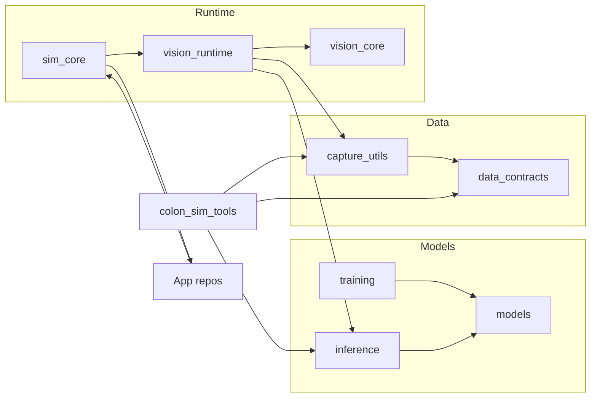
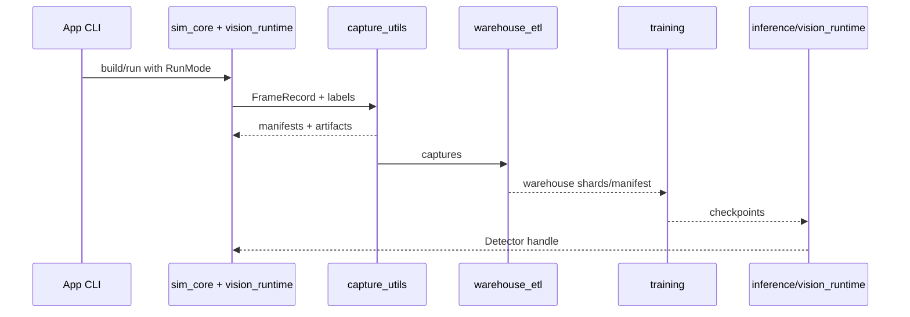

# Architecture: substrate + apps

How CortenForge is structured, how data/control flow through it, and where apps attach (apps live in their own repos; this repo is library-only).

## Big picture
- **Substrate crates**: `sim_core` (Bevy scaffolding, mode sets, hooks, recorder types), `vision_core` (detector interfaces + overlay math), `vision_runtime` (capture/inference plugins), `data_contracts` (schemas), `capture_utils` (sinks/overlay/prune), `models` (TinyDet/BigDet), `training`, `inference`, `colon_sim_tools` (tools; to be split/trimmed).
- **Apps**: live in app repos (e.g., `colon_sim`, other demos). Apps supply domain systems; substrate stays detector- and domain-agnostic.
- **Entrypoints**: app repos own binaries/CLI; this repo ships shared crates only.



## Runtime flow (per run)
<details>
<summary>Step-by-step</summary>

1. App CLI (in app repo) parses args → choose `RunMode` (Sim/Datagen/Inference) → build Bevy app.
2. Build base via `sim_core::build_app` + `SimPlugin` (mode sets/config) + `SimRuntimePlugin` (runtime systems).
3. Add `vision_runtime` plugins:
   - `CapturePlugin` (image target/readback setup, camera tracking, capture loop).
   - `InferencePlugin` (optional; schedules detector on captured frames).
4. Add app plugins/systems (controls/autopilot/HUD/world, recorder world state).
5. Recorder (from `sim_core`) runs with default `JsonRecorder`; app provides metadata/world state and can inject sinks.
6. Run Bevy app; mode sets gate systems (Common/SimDatagen/Inference).
</details>

## Data flow (happy path)
- **Capture** (`sim_view` interactive from app repo or `datagen` headless) → writes `run_<ts>` dirs under `assets/datasets/captures/` with frames, labels, overlays (optional), manifest.
- **Prune/overlay** (tools via `capture_utils`) → optional `captures_filtered/` and overlays.
- **ETL** (`warehouse_etl`) → tensor warehouse shards + manifest under `artifacts/tensor_warehouse/v<ts>/`.
- **Training** consumes warehouse manifest → checkpoints in `checkpoints/` (TinyDet/BigDet).
- **Inference** (live via `inference_view` in app repo or single-image) loads checkpoint; falls back to heuristic detector if none provided.



## Call graph (high level)
- App orchestrator → `sim_core::build_app` → add `SimPlugin`/`SimRuntimePlugin` → add `vision_runtime` capture (+ inference when requested) → add app plugins (`AppSystemsPlugin`, `AppBootstrapPlugin`, etc.) → `App::run`.
- Recorder pipeline: app injects `RecorderMetaProvider` + `RecorderWorldState` updates; substrate installs default sink; frames/labels flow to disk; tools/ETL read manifests.

## Design principles
- Keep substrate detector-free and domain-agnostic; apps own world/systems.
- Small, explicit surfaces: SimHooks, recorder meta/world state, vision hooks; avoid sprawling abstraction layers.
- Defaults first; feature-gate heavy deps; NdArray backend for tests.
- Make wiring obvious (plugins, sets, resources); favor clarity over indirection.

## Repository map (at a glance)
```text
sim_core/         # Bevy plumbing + hooks + recorder types
vision_core/      # detector interfaces + overlay math
vision_runtime/   # capture/inference plugins for Bevy
data_contracts/   # schemas + validation
capture_utils/    # recorder sinks + overlay/prune helpers
models/           # TinyDet/BigDet definitions
training/         # training crate (loss/config/checkpoint plumbing)
inference/        # detector factory (Burn + heuristic)
crates/           # supporting libs (cli_support, burn_dataset, cortenforge umbrella)
tools/            # CLI tools (overlay/prune/etl/cmd/scheduler/tui)
docs/contributor_book/ # contributor guide
```
