# Release & publishing

How we version, prep, and publish crates. Current target: `0.1.1`. Blocker: upstream `burn-core` bincode break (temporary vendored patch to 0.14.0; drop once Burn publishes a fix).

## Versioning policy
- Pre-1.0 semver: bump patch for any published change (API or behavior). Keep crates aligned at the same minor/patch for now (`0.1.x`).
- MSRV: Rust 1.75+; keep metadata in `Cargo.toml` and README in sync.
- Crates not published: `colon_sim_tools` (app-specific; publish = false).

## Release prep checklist
1) Ensure repo points to crates.io deps (no path overrides) and drop `[patch.crates-io]` once Burn is fixed.
2) Refresh lockfile and run validations:
   ```bash
   cargo fmt --all
   cargo clippy --all-targets --all-features --workspace -- -D warnings
   cargo test --workspace
   cargo hakari generate && cargo hakari manage-deps
   cargo test --workspace --locked
   mdbook build docs/contributor_book
   ```
3) Verify crate metadata: `repository`/`homepage` point to this repo; license = Apache-2.0.
4) Update release notes (RELEASE.md) and version strings in docs/README if needed.

## Publish order (dry-run then publish)
```bash
for c in cortenforge-data-contracts cortenforge-models cortenforge-burn-dataset cortenforge-cli-support cortenforge-vision-core cortenforge-sim-core cortenforge-capture-utils cortenforge-inference cortenforge-vision-runtime cortenforge-training cortenforge; do
  cargo publish --dry-run -p $c
  cargo publish -p $c
done
```
- Keep `colon_sim_tools` unpublished.
- If any crate fails, fix, retag locally, and resume from the failed crate (order matters for deps).

```mermaid
flowchart LR
    DC[cortenforge-data-contracts] --> M[cortenforge-models]
    M --> BD[cortenforge-burn-dataset]
    BD --> CLI[cortenforge-cli-support]
    CLI --> VC[cortenforge-vision-core]
    VC --> SC[cortenforge-sim-core]
    SC --> CU[cortenforge-capture-utils]
    CU --> INF[cortenforge-inference]
    INF --> VR[cortenforge-vision-runtime]
    VR --> TRN[cortenforge-training]
    TRN --> CF[cortenforge]
```



## Tagging/pushing
```bash
git tag -a v0.1.1 -m "Release v0.1.1"
git push origin v0.1.1
git push
```

## Burn-core note (temporary)
- `burn-core 0.14.0` on crates.io pulls `bincode 2.0.1`, missing `decode_borrowed_from_slice`, breaking publish/build without a lockfile.
- Temporary workaround: vendor/patch `burn-core 0.14.0`. Drop the patch when Burn ships a fixed release (or we pin bincode exact upstream).
- After the fix: remove `[patch.crates-io]` burn-core override, delete `vendor/burn-core-0.14.0`, `cargo update -p burn-core`, rerun the checklist above, then publish.

## Known non-published pieces
- `colon_sim_tools`: keep app-specific bins out of crates.io; plan to split shared vs app-specific tooling and publish only the shared portion if needed later.
