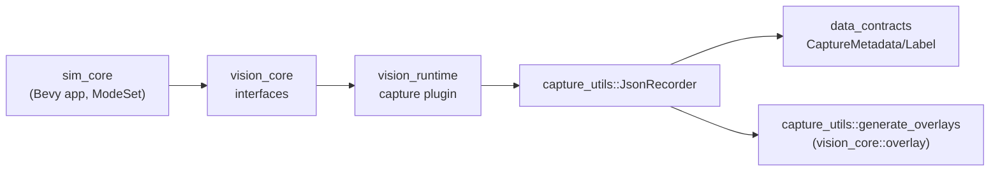
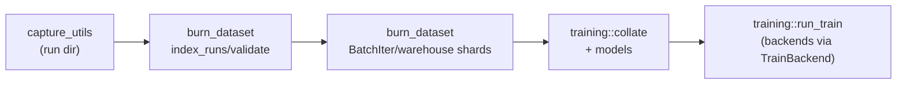
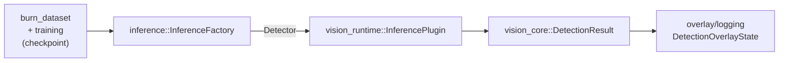
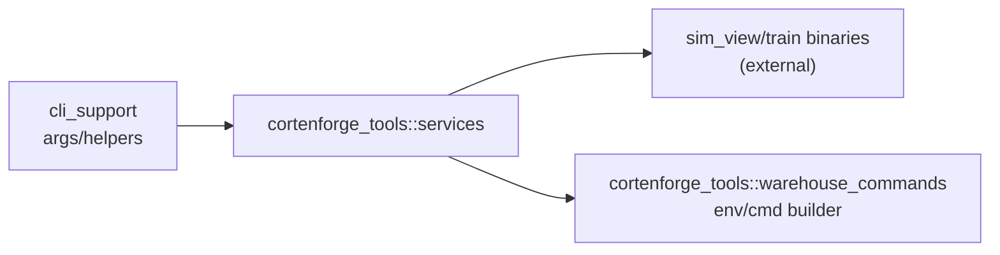

# Canonical Flows
**Why**: See the end-to-end paths without diving into every crate.
**How it fits**: Use this when you need a system-level mental model.
**Learn more**: Follow the guided path in [Building Apps](../20_building_apps/README.md).

Below are the key end-to-end flows that stitch the crates together. Each diagram highlights the crate touchpoints and the primary data moving through them.

## 1) Capture → Labels → Overlays

Steps:
1. `sim_core` sets up Bevy app + modes; `vision_core` interfaces define `Frame`/`Recorder`.
2. `vision_runtime::CapturePlugin` captures frames/readback; emits `FrameRecord`s.
3. `capture_utils::JsonRecorder` writes labels (`CaptureMetadata`) to disk using `data_contracts`.
4. `capture_utils::generate_overlays` draws boxes via `vision_core::overlay` to create PNG overlays.

Notes:
- Default pipeline is NdArray-only; GPU paths are feature-gated.
- Recorder sink is pluggable; swap in other sinks if needed.

## 2) Capture → Warehouse ETL → Training

Steps:
1. Use `burn_dataset::index_runs` / `summarize_with_thresholds` to validate captured runs.
2. Build `BatchIter` or warehouse loaders (in-memory or streaming) to produce Burn tensors.
3. `training::collate` shapes batches (images/boxes/features); `models` provide `TinyDet`/`BigDet`.
4. `training::run_train` (CLI/bin) runs the training loop on NdArray or WGPU backend.

Notes:
- Batch images must share dimensions unless you add resize/pad; `max_boxes` drives tensor shapes.
- Env flags (`BURN_DATASET_PERMISSIVE`, `WAREHOUSE_STORE`, etc.) tune performance/strictness.

## 3) Checkpointed Inference Runtime

Steps:
1. Take a Burn checkpoint produced by training (`models` weights).
2. `inference::InferenceFactory` loads it (or falls back to heuristic).
3. `vision_runtime::InferencePlugin` schedules async inference on captured frames (ModeSet::Inference).
4. Results populate `DetectionOverlayState` (boxes/scores/fallback) for UI/recorder consumption.

Notes:
- Mutex-guarded detector serializes inference; for higher throughput, consider per-thread detectors.
- Hotkeys can adjust thresholds and force heuristic fallback at runtime.

## 4) Tooling & Orchestration (optional bins)

Steps:
1. Parse CLI options with `cli_support` and shared helpers in `cortenforge_tools::services`.
2. Launch simulation/datagen (`sim_view`) or training (`train`) via `ServiceCommand`.
3. Build warehouse command lines with `warehouse_commands` for scripted runs.

Notes:
- `cortenforge-tools` is app-agnostic; app-specific bins live in the app repo.
- `cortenforge-tools` is published; shared bits remain in the tools crate.
