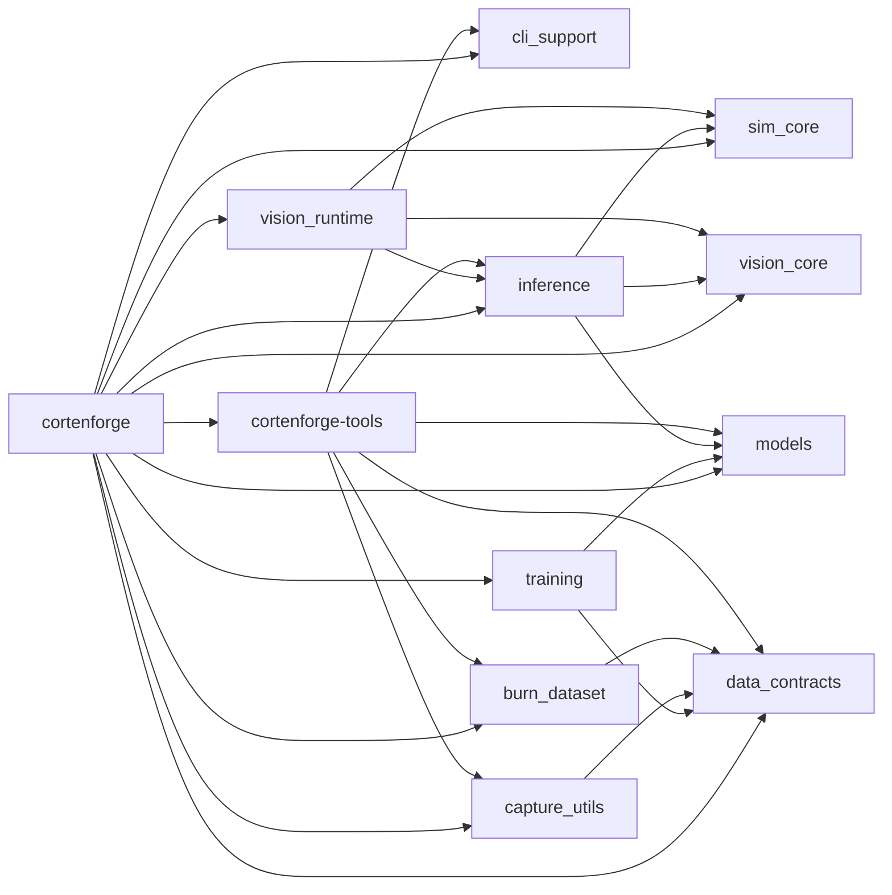

# Workspace overview
**Why**: The single "big picture" view of the workspace.
**How it fits**: Read it once, then follow links as needed.
**Learn more**: See [Building Apps](../20_building_apps/README.md) for the guided path.

Package names use hyphens (e.g., `cortenforge-tools`), while Rust crate imports use underscores (e.g., `cortenforge_tools`).

# Dependency Graph
One diagram that shows how the crates lean on each other.

Dependency Graph Interpretation

## Interpretation
| Area | Details |
| --- | --- |
| Core runtime path | `sim_core`, `vision_core`, and `vision_runtime` drive runtime, capture, and inference; inference hooks up detectors; models provides TinyDet/BigDet. |
| Runtime entry point | Apps typically start with `sim_core::build_app`, then add `vision_runtime` capture/inference plugins; hooks wire controls/autopilot. |
| Capture output | `vision_runtime` emits `FrameRecord`s; `capture_utils` recorders write JSON + images using `data_contracts` schemas. |
| Data path | `data_contracts` defines schemas; `capture_utils` and tools use them; `burn_dataset` consumes schemas for Burn loaders. |
| Dataset ingestion | `burn_dataset` indexes/validates capture runs, builds Burn-compatible batches/iterators used by `training`. |
| Training path | `training` depends on `models` and `data_contracts` to produce <a href="https://dataconomy.com/2025/05/09/what-is-machine-learning-checkpointing/">checkpoints</a>; `inference` consumes them. |
| Training to inference | `training` writes checkpoints; `inference` loads them to build detectors used by runtime or tools. |
| Tooling | `cortenforge-tools` wraps CLI helpers (`cli_support`), recorder/capture (`capture_utils`), schemas (`data_contracts`), dataset (`burn_dataset`), and inference/models; tooling is now app‑agnostic and config‑driven. |
| Umbrella | `cortenforge` re-exports the stack with feature wiring. |
| Dependency direction | Arrows generally point from higher-level crates to lower-level foundations; `data_contracts` and `vision_core` sit on many paths. |
| Change impact | Schema changes in `data_contracts` or interface changes in `vision_core` ripple across capture, training, and tools. |

  

## Core crates (high centrality)
Critical foundations for runtime, contracts, and model definitions.
| Crate | Version | Path | Type | Edition | Notes |
| ----- | ------- | ---- | ---- | ------- | ----- |
| **cortenforge-sim-core** | 0.2.0 | crates/sim_core | lib | 2021 | Bevy runtime scaffolding, hooks, recorder types |
| **cortenforge-vision-core** | 0.2.0 | crates/vision_core | lib | 2021 | Vision interfaces, overlay math |
| **cortenforge-data-contracts** | 0.2.0 | crates/data_contracts | lib | 2021 | Schemas/validation for captures/warehouse |
| **cortenforge-models** | 0.2.0 | crates/models | lib | 2021 | TinyDet/BigDet definitions |

 

<strong>Rationale</strong>

Core crates sit on the critical path of runtime (sim_core/vision_core) and data contracts/models that feed training/inference.

## Mid-layer
Crates that adapt core capabilities into training, inference, and tooling utilities.

| Crate | Version | Path | Type | Edition | Notes |
| ----- | ------- | ---- | ---- | ------- | ----- |
| **cortenforge-inference** | 0.2.0 | crates/inference | lib | 2021 | Detector factory (Burn-backed/heuristic) |
| **cortenforge-training** | 0.2.0 | crates/training | lib + bins | 2021 | Burn training/eval CLI (train/eval bins) |
| **cortenforge-capture-utils** | 0.2.0 | crates/capture_utils | lib | 2021 | Recorder sinks and capture helpers |
| **cortenforge-burn-dataset** | 0.2.0 | crates/burn_dataset | lib | 2021 | Burn dataset loading/splitting |
| **cortenforge-cli-support** | 0.2.0 | crates/cli_support | lib | 2021 | Shared CLI args/helpers; optional Bevy feature |

 

<strong>Rationale</strong>

Mid-layer crates adapt core capabilities to specific tasks (detector factory, training, recorder sinks, CLI parsing).

## Leaf/runtime tooling
Runtime glue and app-facing tooling crates with fewer inward dependencies.

| Crate | Version | Path | Type | Edition | Notes |
| ----- | ------- | ---- | ---- | ------- | ----- |
| **cortenforge-vision-runtime** | 0.2.0 | crates/vision_runtime | lib | 2021 | Capture/inference plugins for Bevy |
| **cortenforge-tools** | 0.2.0 | tools | lib + bins | 2021 | Tooling crate (crate `cortenforge_tools`); app‑agnostic bins with feature‑gated optional tooling |

 

<strong>Rationale</strong>

Leaf/runtime tooling crates are consumers or runtime glue with fewer inward dependencies.

## Umbrella
Single entry-point facade that re-exports the stack behind feature flags.

| Crate | Version | Path | Type | Edition | Notes |
| ----- | ------- | ---- | ---- | ------- | ----- |
| **cortenforge** | 0.2.0 | root | lib | 2024 | Umbrella re-export; feature wiring |

 

<strong>Rationale</strong>

The umbrella crate is a facade that re-exports the stack with feature wiring.

 
