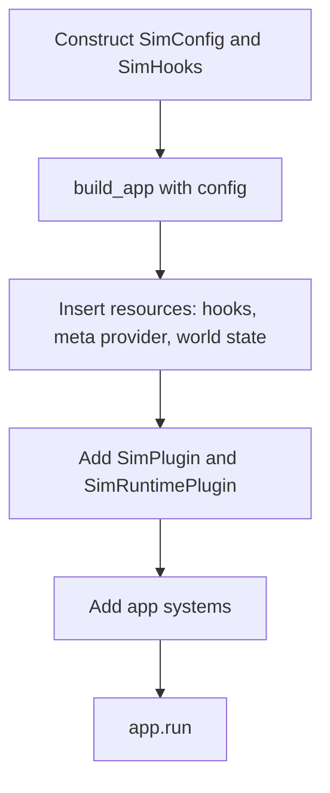
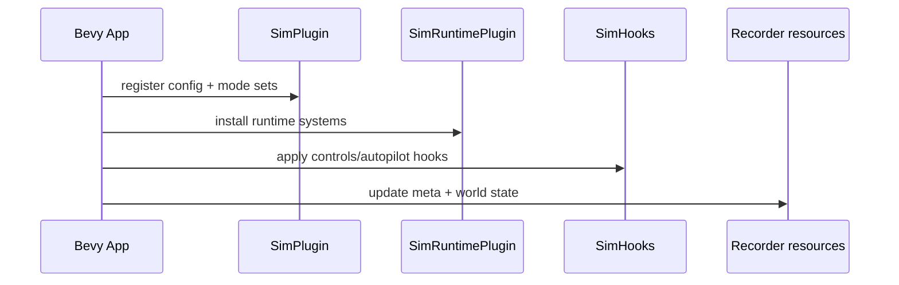

# sim_core: Lifecycle
Quick read: How data flows through this crate in practice.

## Typical usage
1) Construct config and hooks:
   ```rust,ignore
   let config = SimConfig::default();
   let hooks = SimHooks::default() // optional ControlsHook/AutopilotHook
       .with_controls(Box::new(MyControls))
       .with_autopilot(Box::new(MyAutopilot));
   ```
2) Build the Bevy app and insert hooks/recorder meta/world state:
   ```rust,ignore
   let mut app = sim_core::build_app(config);
   app.insert_resource(hooks);
   app.insert_resource(RecorderMetaProvider { provider: Box::new(MyMeta {}) });
   app.insert_resource(RecorderWorldState::default());
   ```
3) Add plugins and systems:
   ```rust,ignore
   app.add_plugins((SimPlugin, SimRuntimePlugin));
   app.add_systems(Update, my_world_state_updater.in_set(ModeSet::Common));
   ```
4) Run the app:
   ```rust,ignore
   app.run();
   ```

## Execution flow
- `build_app` seeds Bevy with default plugins, Rapier, mode sets.
- `SimPlugin` registers config and system sets (Common/SimDatagen/Inference).
- `SimRuntimePlugin` installs runtime systems.
- Hooks (controls/autopilot) are invoked based on mode sets.
- Recorder resources collect meta/world state; sink provided by capture_utils or app.

## Mermaid maps

### Setup to run (high level)


### Runtime execution flow


## Shutdown/cleanup
- Standard Bevy app lifecycle; no special shutdown beyond Bevy teardown.

## Links
- Source: `crates/sim_core/src/lib.rs`
- Module: `crates/sim_core/src/runtime.rs`
