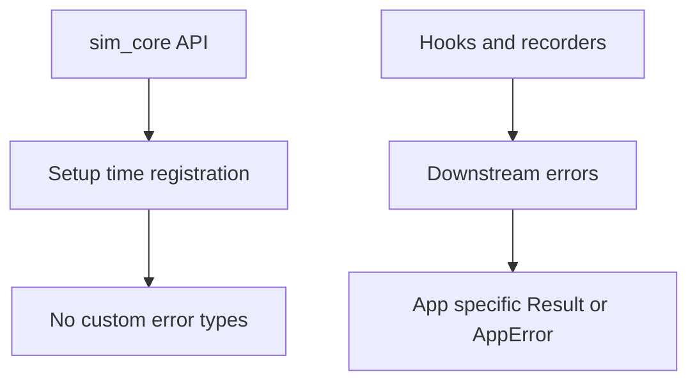
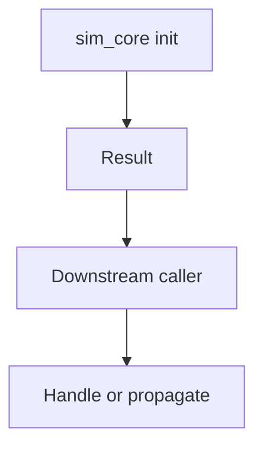

# Error Model (sim_core)
Quick read: How errors are surfaced and handled.

## Errors defined
- None. sim_core does not define custom error types; it provides Bevy resources/hooks and relies on downstream crates for IO/inference errors.

## Patterns
- Hook application (`SimHooks::apply`) and recorder metadata use trait objects without fallible paths.
- Panic risk: none beyond standard library panics if poisoned mutexes or similar were introduced elsewhere; current code is straightforward.

## Recoverability
- All operations are setup-time Bevy registration; no runtime fallible APIs exposed.

## Ergonomics
- Simplicity: no Result-heavy flows. Consumers should surface their own errors when implementing hooks or recorders.
- If new fallible initialization is added (e.g., asset loading), prefer returning `bevy::app::AppError` or custom error enums to keep ergonomics consistent across the workspace.

## Mermaid map

### Error surface (current)

### Error surface (if fallible init is added)
If sim_core introduces fallible initialization (asset loading, external services), this is the recommended flow.

## Links
- Source: `sim_core/src/lib.rs`
