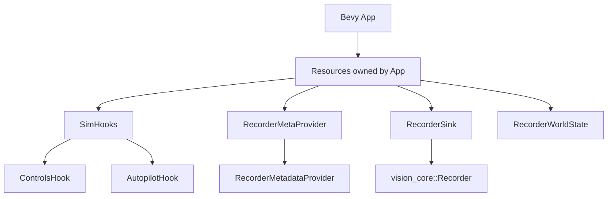
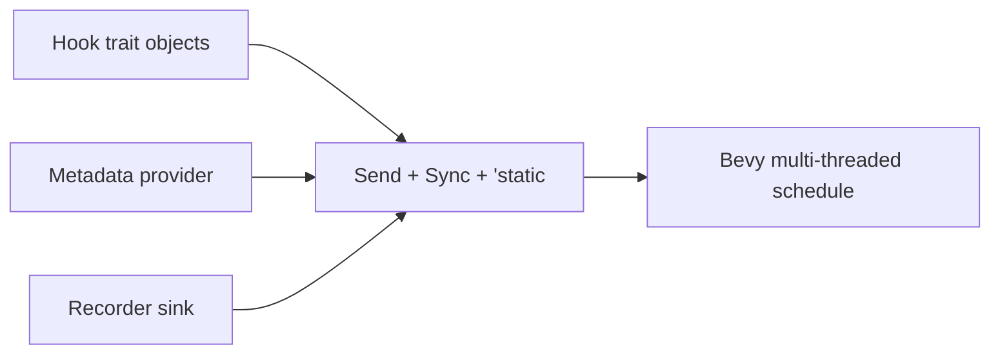
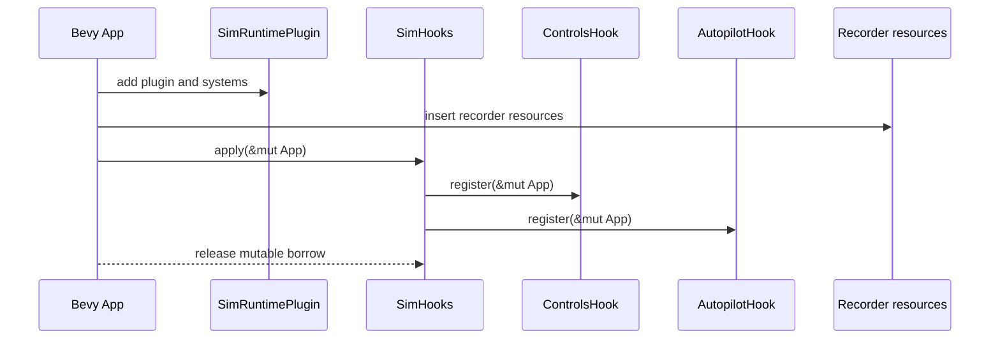

# Ownership & Concurrency (sim_core)
Quick read: Ownership, threading, and async expectations.

## Ownership model
- Resources (`SimHooks`, `RecorderMetaProvider`, `RecorderSink`, `RecorderWorldState`) are stored as Bevy resources with owned boxed trait objects.
- Hooks are applied by borrowing `&mut App`; no shared references persist beyond setup.

## Concurrency
- No explicit threading or async. Trait objects are bounded by `Send + Sync + 'static` to be Bevy-resource safe if Bevy uses multi-threaded schedules.
- Recorder sink and metadata provider are boxed trait objects; implementations must be thread-safe due to bounds.

## Borrowing boundaries
- Hook registration occurs during setup; lifetimes are `'static` via boxed trait objects. No non-'static borrows are stored.

## Async boundaries
- None in this crate; async behavior lives in higher layers (vision_runtime).

## Risks / notes
- Minimal; ensure custom hook/recorder implementations honor `Send + Sync` and avoid interior mutability pitfalls beyond what Bevy expects.

## Mermaid maps

### Ownership flow (resources)

### Concurrency boundaries

### Setup-time borrowing

## Links
- Source: `sim_core/src/hooks.rs`
- Module: `sim_core/src/runtime.rs`
