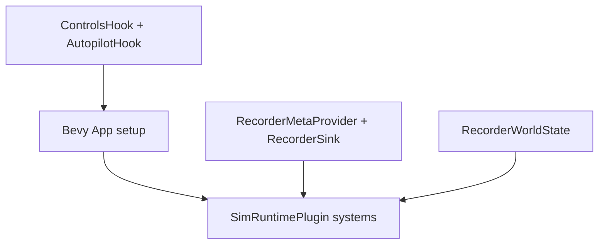
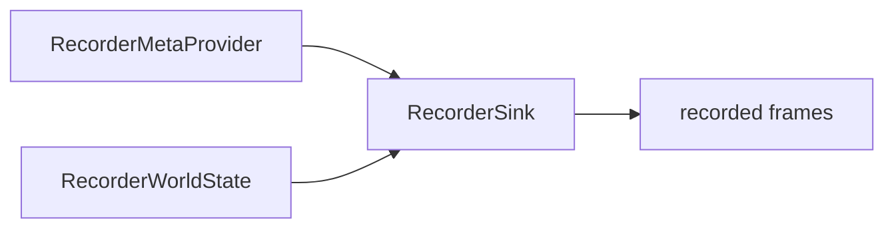

# Examples (sim_core)
Quick read: Minimal examples you can adapt safely.

## 1) Register custom hooks (controls + autopilot)
```rust,ignore
use bevy::prelude::*;
use sim_core::hooks::{AutopilotHook, ControlsHook, SimHooks};

struct MyControls;
impl ControlsHook for MyControls {
    fn register(&self, app: &mut App) {
        app.add_systems(Update, |time: Res<Time>| {
            // drive controls/resources here
            info!("tick {:?}", time.elapsed_seconds_wrapped());
        });
    }
}

struct MyAutopilot;
impl AutopilotHook for MyAutopilot {
    fn register(&self, app: &mut App) {
        app.add_systems(Update, |mut commands: Commands| {
            // spawn autopilot systems/entities
            commands.spawn_empty();
        });
    }
}

fn main() {
    let mut app = App::new();
    app.insert_resource(SimHooks {
        controls: Some(Box::new(MyControls)),
        autopilot: Some(Box::new(MyAutopilot)),
    });
    // later: call SimHooks::apply(&mut app) in your setup stage
}
```

## 2) Provide recorder metadata + sink
```rust,ignore
use bevy::prelude::*;
use sim_core::recorder_meta::{BasicRecorderMeta, RecorderMetaProvider, RecorderMetadataProvider, RecorderSink};

fn setup_recorder(mut commands: Commands) {
    // Provide run-level metadata (e.g., seed)
    commands.insert_resource(RecorderMetaProvider {
        provider: Box::new(BasicRecorderMeta { seed: 1234 }),
    });

    // Provide a recorder sink (here just a placeholder that does nothing)
    struct NullRecorder;
    impl vision_core::prelude::Recorder for NullRecorder {
        fn record(&mut self, _record: &vision_core::prelude::FrameRecord) -> std::io::Result<()> {
            Ok(())
        }
    }
    commands.insert_resource(RecorderSink {
        writer: Some(Box::new(NullRecorder)),
    });
}
```

## 3) Wire world state for recorder triggers
```rust,ignore
use bevy::prelude::*;
use sim_core::recorder_meta::RecorderWorldState;

fn update_world_state(mut state: ResMut<RecorderWorldState>) {
    state.head_z = Some(1.2);
    if state.head_z.unwrap() > 2.0 {
        state.stop_flag = true; // could be read by recorder triggers
    }
}
```

## Mermaid maps

### Examples overview


### Recorder pipeline


## Links
- Source: `crates/sim_core/src/hooks.rs`
- Source: `crates/sim_core/src/recorder_meta.rs`
