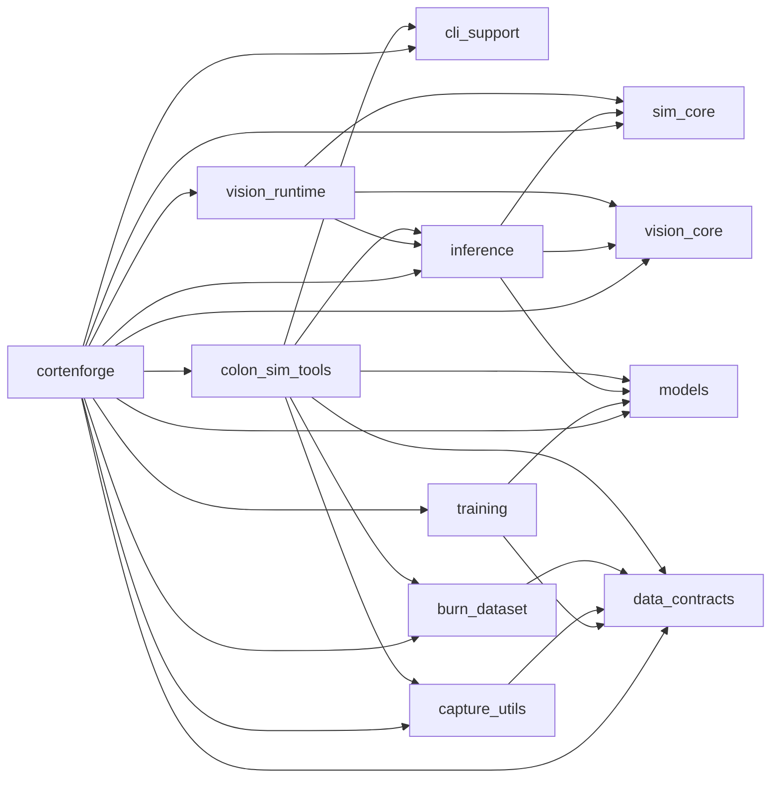

# Workspace overview

# Dependency Graph

Dependency Graph Interpretation

## Interpretation
| Area | Details |
| --- | --- |
| Core runtime path | `sim_core` + `vision_core` + `vision_runtime` form the runtime/capture/inference stack; `inference` wires detectors; `models` provides TinyDet/BigDet. |
| Data path | `data_contracts` defines schemas; `capture_utils` and tools use them; `burn_dataset` consumes schemas for Burn loaders. |
| Training path | `training` depends on `models` and `data_contracts` to produce checkpoints; `inference` consumes them. |
| Tooling | `colon_sim_tools` wraps CLI helpers (`cli_support`), recorder/capture (`capture_utils`), schemas (`data_contracts`), dataset (`burn_dataset`), and inference/models; **planned to be split into app-agnostic vs. app-specific pieces in the future.** |
| Umbrella | `cortenforge` re-exports the stack with feature wiring. |

  

## Core crates (high centrality)
| Crate | Version | Path | Type | Edition | Notes |
| ----- | ------- | ---- | ---- | ------- | ----- |
| **cortenforge-sim-core** | 0.1.1 | sim_core | lib | 2021 | Bevy runtime scaffolding, hooks, recorder types |
| **cortenforge-vision-core** | 0.1.1 | vision_core | lib | 2021 | Vision interfaces, overlay math |
| **cortenforge-data-contracts** | 0.1.1 | data_contracts | lib | 2021 | Schemas/validation for captures/warehouse |
| **cortenforge-models** | 0.1.1 | models | lib | 2021 | TinyDet/BigDet definitions |

 

<strong>Rationale</strong>

Core crates sit on the critical path of runtime (sim_core/vision_core) and data contracts/models that feed training/inference.

## Mid-layer

| Crate | Version | Path | Type | Edition | Notes |
| ----- | ------- | ---- | ---- | ------- | ----- |
| **cortenforge-inference** | 0.1.1 | inference | lib | 2021 | Detector factory (Burn-backed/heuristic) |
| **cortenforge-training** | 0.1.1 | training | lib + bins | 2021 | Burn training/eval CLI (train/eval bins) |
| **cortenforge-capture-utils** | 0.1.1 | capture_utils | lib | 2021 | Recorder sinks and capture helpers |
| **cortenforge-burn-dataset** | 0.1.1 | crates/burn_dataset | lib | 2021 | Burn dataset loading/splitting |
| **cortenforge-cli-support** | 0.1.1 | crates/cli_support | lib | 2021 | Shared CLI args/helpers; optional Bevy feature |

 

<strong>Rationale</strong>

Mid-layer crates adapt core capabilities to specific tasks (detector factory, training, recorder sinks, CLI parsing).

## Leaf/runtime tooling

| Crate | Version | Path | Type | Edition | Notes |
| ----- | ------- | ---- | ---- | ------- | ----- |
| **cortenforge-vision-runtime** | 0.1.1 | vision_runtime | lib | 2021 | Capture/inference plugins for Bevy |
| **colon_sim_tools** | 0.1.1 | tools | lib + bins | 2021 | Tooling crate; bins include overlay/prune/etl/export/cmd/single_infer; app-facing bins gated by features |

 

<strong>Rationale</strong>

Leaf/runtime tooling crates are consumers or runtime glue with fewer inward dependencies.

## Umbrella

| Crate | Version | Path | Type | Edition | Notes |
| ----- | ------- | ---- | ---- | ------- | ----- |
| **cortenforge** | 0.1.1 | crates/cortenforge | lib | 2024 | Umbrella re-export; feature wiring |

 

<strong>Rationale</strong>

The umbrella crate is a facade that re-exports the stack with feature wiring.

 

