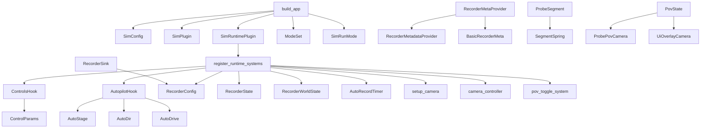

# sim_core: Public API

| Item | Kind | Purpose |
| ---- | ---- | ------- |
| SimRunMode | enum | Runtime modes (Common/SimDatagen/Inference) |
| SimConfig | struct | Configuration for building the sim app (run mode, options) |
| ModeSet | enum | Bevy system sets corresponding to run modes |
| SimPlugin | struct | Bevy plugin registering config/mode sets |
| SimRuntimePlugin | struct | Bevy plugin installing runtime systems |
| build_app | fn | Build a Bevy App with default plugins/sets |
| SimHooks | struct | Holds optional ControlsHook/AutopilotHook callbacks |
| ControlsHook | trait | App-defined control hook interface |
| AutopilotHook | trait | App-defined autopilot hook interface |
| RecorderMetadataProvider | trait | Provides run metadata for recorder |
| RecorderMetaProvider | struct | Wrapper resource implementing provider |
| BasicRecorderMeta | struct | Simple metadata implementation |
| RecorderSink | struct | Wrapper for recorder sink resource |
| RecorderWorldState | struct | World-state snapshot for recorder |
| RecorderConfig | struct | Recorder configuration (paths/options) |
| RecorderState | struct | Recorder state tracking |
| AutoRecordTimer | struct | Timer helper for auto-recording |
| RecorderMotion | struct | Motion info for recorder |
| ControlParams | struct | Input params for controls |
| ProbeSegment | struct | Probe segment type |
| SegmentSpring | struct | Spring parameters for probe segments |
| AutoStage | enum | Autopilot stage |
| AutoDir | enum | Autopilot direction |
| AutoDrive | struct | Autopilot drive parameters |
| DataRun | struct | Datagen run metadata |
| DatagenInit | struct | Datagen init parameters |
| Flycam | struct | Fly camera controller |
| ProbePovCamera | struct | Probe POV camera marker |
| PovState | struct | POV state resource |
| UiOverlayCamera | struct | UI overlay camera marker |
| setup_camera | fn | Bevy system to set up cameras |
| camera_controller | fn | Bevy system for camera control |
| pov_toggle_system | fn | Bevy system to toggle POV |
| register_runtime_systems | fn | Install runtime systems into App |
| Modules (pub mod) | module | autopilot_types, camera, controls, hooks, probe_types, recorder_meta, recorder_types, runtime, prelude |

## Usage map (high level)

