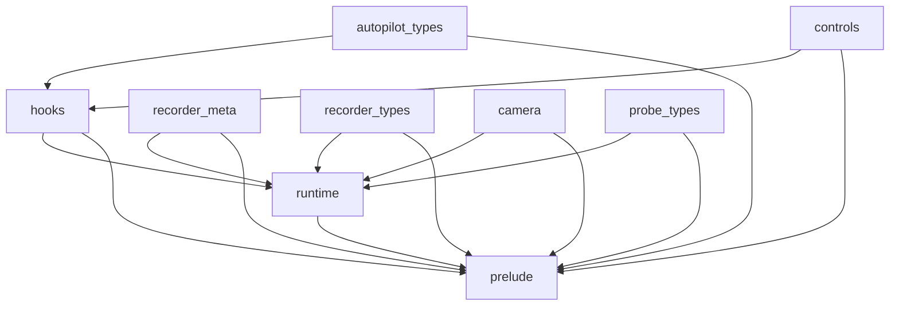
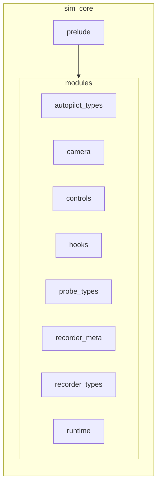

# sim_core: Module Map

- `autopilot_types`: Autopilot-related types (AutoStage/AutoDir/AutoDrive/DataRun/DatagenInit).
- `camera`: Camera resources/systems (Flycam, ProbePovCamera, UiOverlayCamera), setup and controller systems.
- `controls`: Control parameter structs and related utilities.
- `hooks`: Hook traits (ControlsHook, AutopilotHook) and SimHooks container.
- `probe_types`: Probe segment types (ProbeSegment, SegmentSpring).
- `recorder_meta`: Recorder metadata provider trait and wrappers (RecorderMetadataProvider, RecorderMetaProvider, BasicRecorderMeta, RecorderSink, RecorderWorldState).
- `recorder_types`: Recorder config/state/motion types (RecorderConfig, RecorderState, AutoRecordTimer, RecorderMotion).
- `runtime`: Runtime plugin and system registration (SimRuntimePlugin, register_runtime_systems).
- `prelude`: Convenience re-exports for downstream users.

Cross-module dependencies: hooks/config feed runtime; recorder_meta/types used by runtime and apps; camera systems integrate with runtime; autopilot/control types used by hooks/apps.

## Mermaid maps

### Module dependency graph (high level)

### Public surface grouping

