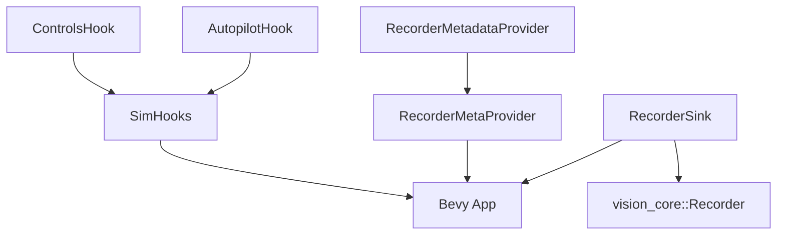
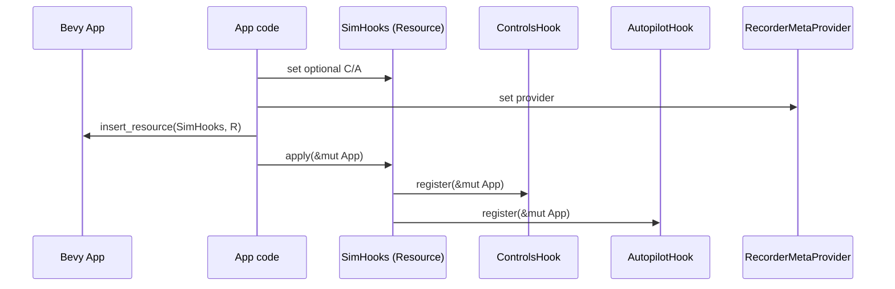

# Traits & Generics (sim_core)

## Extensibility traits
- `ControlsHook`: app provides control systems; required method `register(&mut App)`. Marker bounds `Send + Sync + 'static` so it can live in resources and cross threads.
- `AutopilotHook`: app provides autopilot systems; same shape/bounds as `ControlsHook`.
- `RecorderMetadataProvider`: app supplies run-level metadata (e.g., polyp seed) for recorders; `Send + Sync + 'static` for resource safety.

## Glue types
- `SimHooks` (Resource) stores optional boxed `ControlsHook` / `AutopilotHook` and invokes `apply` to register them.
- `RecorderMetaProvider` (Resource) wraps a boxed `RecorderMetadataProvider`.
- `RecorderSink` (Resource) holds a boxed `vision_core::Recorder` (trait object) for output sinks.

## Mermaid maps

### Trait-to-resource wiring

### Lifecycle view

## Generics and bounds
- No generic types in this crate; extensibility is via trait objects with `Send + Sync + 'static` to satisfy Bevy resource requirements.
- Hooks require `&mut App` to register systems/plugins, keeping ownership straightforward and avoiding lifetime gymnastics.

## Design notes
- Trait-object approach keeps app integration simple (no generics on `App`), at the cost of dynamic dispatch; fine for setup-time hooks.
- If more metadata fields are needed, extend `RecorderMetadataProvider` instead of threading ad-hoc resources.
- Keep hook registration idempotent; current design assumes the caller manages not to double-register.
