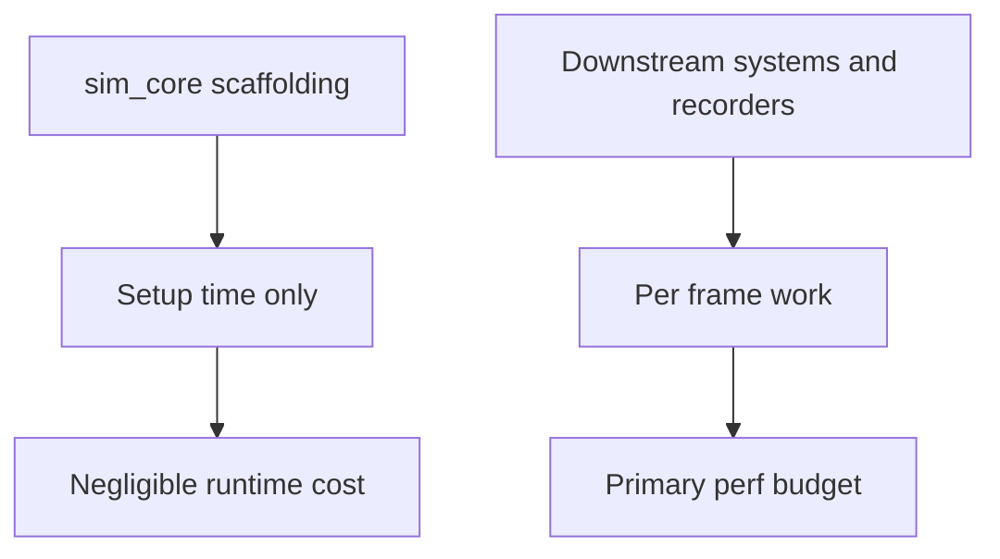
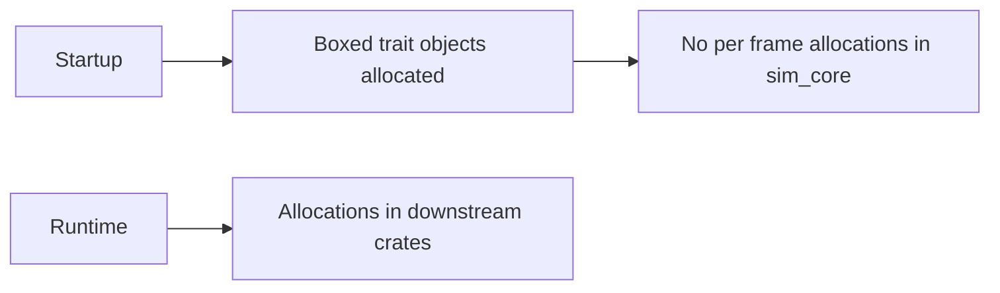

# Performance Notes (sim_core)

## Hot paths
- None in this crate; it provides Bevy scaffolding, hooks, and recorder metadata resources. No heavy per-frame computation here.

## Allocation patterns
- Minimal allocations for boxed trait objects (`SimHooks`, `RecorderMetaProvider`, `RecorderSink`).
- No per-frame allocations within sim_core itself.

## Trait objects
- Hooks and recorder providers are trait objects; dynamic dispatch cost is negligible and occurs during setup or recorder use.

## Assumptions
- Performance-sensitive work (simulation systems, recorders) lives in downstream crates/apps; sim_core’s overhead is negligible compared to Bevy runtime.

## Improvements
- None needed at this layer. Keep hook invocation minimal and avoid duplicate registration to keep startup cost low.

## Mermaid maps

### Performance surface

### Allocation timing

